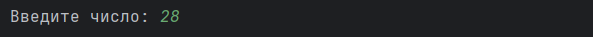
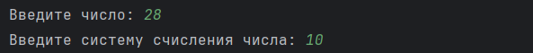
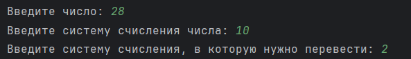
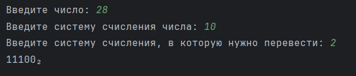

Инструкция по использованию программы «NumberSystemConverter» проекта «DigitalHub»
=========

1. **Установите программу из GitHub на свой ПК. Откройте ее в PyCharm, Visual Studio Code или в другом редакторе. Запустите программу.**

2. **Вам будет предложено ввести с клавиатуры три числа:**
   * ***Число, которое вы хотите перевести из одной системы счисления в другую («Введите число: »).***
     
      *Пример (Ввели число 28):*
     
     

   * ***Систему счисления исходного числа («Введите систему счисления числа: »)***

     *Пример (Ввели систему счисления исходного числа - 10):*
     
     

   * ***Систему счисления, в которую нужно перевести исходное число («Введите систему счисления, в которую нужно перевести: »***

      *Пример (Ввели систему счисления, в которую надо перевести - 2):*
     
     

3. **После данных действий Вам будет выведен результат.**

      *Пример (Вывелся на экран результат - 11100₂):*
   
     

Ошибки, которые может выдать программа «NumberSystemConverter»
=========

1. **«Число <введённое число> не соответствует системе счисления <исходная система счисления>. Пожалуйста, введите число заново» — Ваше число превышает введённую систему счисления (содержит символы из более старшей системы счисления).**

2. **«Неправильный формат. В числе <введённое число> присутствует некорректный символ. Пожалуйста, введите число заново.» — В Вашем числе присутствуют символы, которые не позволяют выполнить операцию перевода. В числе могут находиться только цифры 0-9 и буквы английского алфавита A-Z в любом регистре.**
 
3. **«Исходной системы счисления, равной <исходная система счисления> не существует. Пожалуйста, введите систему счисления заново.» — Введённой Вами исходной системы счисления Вашего числа не существует. Обычно это все системы счисления, меньше двоичной.**
   
4. **«Системы счисления <система счисления для перевода>, в которую нужно перевести, не существует. Пожалуйста, введите систему счисления заново.» — Введённой Вами системы счисления, в которую необходимо перевести Ваше число, не существует. Обычно это все системы счисления, меньше двоичной.**
   
5. **«Введённые системы счисления содержат недопустимые символы или их не существует.» — Одна или обе системы счисления, введённые Вами, содержат символы, которые не позволяют выполнить операцию перевода. В числе для системы счисления могут находиться только цифры 0-9. (Другие возможные причины: см. пункт 3 и пункт 4).**

